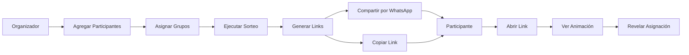

# 🎁 Sorteo Amigo Secreto

Sistema web para organizar sorteos de Amigo Secreto con características avanzadas y sin necesidad de base de datos.

[](https://TU-USUARIO.github.io/SorteAmigoSecreto/)
[](LICENSE)

---

## 📖 Documentación

- 📘 [**Inicio Rápido**](QUICKSTART.md) - Comienza en 5 minutos
- 🚀 [**Guía de Despliegue**](DEPLOYMENT.md) - Deploy en GitHub Pages
- ⚙️ [**Configuración GitHub Pages**](GITHUB_PAGES_SETUP.md) - Setup paso a paso
- 📚 [**Ejemplos de Uso**](EXAMPLES.md) - Casos prácticos
- 📊 [**Resumen del Proyecto**](PROJECT_SUMMARY.md) - Documentación técnica

---

## ✨ Características

- 🎯 **Sorteo Inteligente**: Algoritmo que respeta restricciones familiares y evita auto-asignaciones
- 🔐 **100% Privado**: Los resultados se encriptan en URLs, sin almacenamiento en servidor
- 📱 **Compartir Fácil**: Genera links únicos para WhatsApp o copiar al portapapeles
- 🎨 **Diseño Minimalista**: Interfaz limpia y moderna con animaciones suaves
- 🎉 **Experiencia Interactiva**: Efectos de confeti y animaciones al revelar asignaciones
- 📦 **Sin Backend**: Funciona 100% en el navegador (ideal para GitHub Pages)

## 🚀 Cómo Usar

### Para el Organizador:

1. Visita la aplicación
2. Agrega participantes con sus nombres
3. (Opcional) Asigna grupos familiares para evitar que se regalen entre ellos
4. Haz clic en "Sortear"
5. Comparte los enlaces generados con cada participante

### Para los Participantes:

1. Abre el link que te compartieron
2. Haz clic en "Abrir Regalo"
3. ¡Descubre a quién debes regalarle!

## 🛠️ Tecnologías

- **React 18** - Framework UI
- **Vite** - Build tool ultrarrápido
- **Tailwind CSS** - Estilos utility-first
- **Framer Motion** - Animaciones fluidas
- **Crypto-JS** - Encriptación AES
- **Canvas Confetti** - Efectos visuales
- **React Router** - Navegación
- **GitHub Pages** - Hosting gratuito

## 📦 Instalación Local

```bash
# Navegar a la carpeta del proyecto
cd sorteo-app

# Instalar dependencias
npm install

# Ejecutar en desarrollo
npm run dev

# Construir para producción
npm run build
```

## 🏗️ Arquitectura

El sistema usa un enfoque único para GitHub Pages:

1. **Sorteo**: Se ejecuta localmente en el navegador del organizador
2. **Almacenamiento**: Los resultados se encriptan usando AES y se incluyen en la URL
3. **Revelación**: Al abrir el link, se desencripta y muestra la asignación

### Ejemplo de URL generada:
```
https://tu-usuario.github.io/SorteAmigoSecreto/#/reveal?q=U2FsdGVkX1...
```

## 🔒 Seguridad

- Encriptación AES-256 para todas las asignaciones
- Los datos nunca se almacenan en servidor
- Cada link es único y solo contiene información de una asignación
- No hay cookies ni tracking

## 📋 Algoritmo de Sorteo

El algoritmo implementa:

1. ✅ **Validación previa**: Verifica que el sorteo sea posible
2. 🔀 **Shuffle aleatorio**: Mezcla aleatoriamente los receptores
3. 🚫 **Restricciones**:
   - No puede regalarse a sí mismo
   - No puede regalar a alguien de su mismo grupo familiar
4. 🔁 **Reintentos**: Hasta 1000 intentos para encontrar una combinación válida

## 🎨 Capturas

*(Aquí puedes agregar screenshots de tu aplicación)*

---

## 🎯 Flujo de Trabajo



---

## 🤝 Contribuir

Las contribuciones son bienvenidas! 

1. Fork el proyecto
2. Crea tu rama (`git checkout -b feature/AmazingFeature`)
3. Commit tus cambios (`git commit -m 'Add: nueva característica'`)
4. Push a la rama (`git push origin feature/AmazingFeature`)
5. Abre un Pull Request

---

## 📝 Licencia

MIT License - Siéntete libre de usar y modificar

---

## 👨‍💻 Autor

Desarrollado con ❤️ para hacer los sorteos de Amigo Secreto más divertidos

---

## 🌟 Características Destacadas

| Característica | Descripción |
|---------------|-------------|
| 🔒 **Privacidad** | Sin base de datos, todo en el navegador |
| ⚡ **Rápido** | Carga instantánea, sin backend |
| 🎨 **Bonito** | Diseño minimalista con animaciones |
| 📱 **Responsive** | Funciona en móvil y desktop |
| 🌐 **Gratis** | Hosting gratuito en GitHub Pages |
| 🔐 **Seguro** | Encriptación AES-256 |

---

## 📊 Estado del Proyecto


---

**⭐ Si te gusta este proyecto, dale una estrella en GitHub!**

**¿Preguntas o sugerencias?** Abre un [issue](https://github.com/TU-USUARIO/SorteAmigoSecreto/issues)


